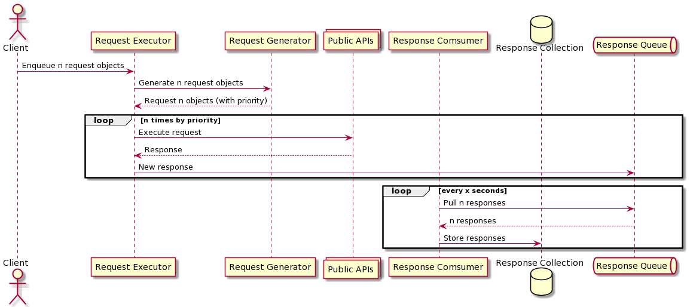
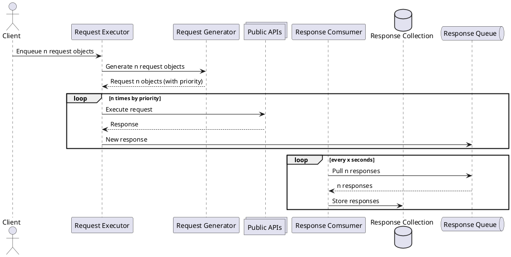

# Abtract

Collects requests and stores they're responses

# Get started

1. Make sure docker and docker-compose are installed
2. clone project
3. `docker-compose up`
4. When all services are idle, fire POST request to enquqe request objects:

`POST /MultiRequestProcess HTTP/1.1`

`Host: <host>:<post>`

# Flow (PUML)

# Q&A:
1. The part of "fetch multiple request objects from the queue" is confusing, did it mean: fetch multiple responses from the queue? THE queue is assumed to be the only mentioned queue, which is the responses queue.
2. What initiates the request generation? The request executor calls it on demand.
3. What initiates the request executor? Client demand by API.
